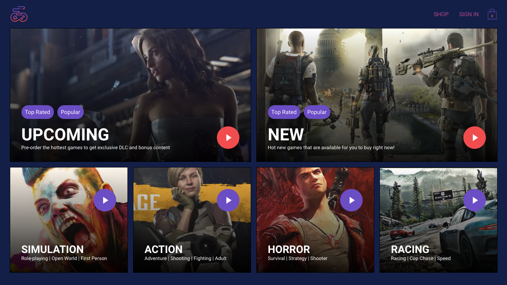

# GameHub - Your one stop shop for buying video games

[GameHub](https://gamehubofficial.herokuapp.com/) is a digital video game store that let's your browse the hottest video games online and buy them using stripe.



## Table of content

- [Description](#description)
- [Installation](#installation)
- [Contact](#contact)

## Description

GameHub is an e-commerce web application built using the MERN stack and firebase that lets you buy video games online.
The application using the following technologies

- ### Front-end - `React`
- ### Back-end - `Firebase`
- ### Webhooks - `NodeJS`
- ### Webhooks - `NodeJS`
- ### Payment Merchant - `Stripe`
- ### Hosting - `Heroku`
- ### Styles - `CSS in JSS`, `Styled components`
- ### State management - `Redux`, `Session Storage`,
- ### Performance
  - `Code splitting & Chunking`
  - `React lazy and suspense`
  - `Error Boundaries`
  - `React memo`
  - `Pure Component`
  - `Gzipping`
- ### Misc Technologies -
  - `React router`
  - `HOC Patterns`
  - `Redux Saga`
  - `React Hooks`
  - `Mobile Support`
  - `Progressive Web App`
  - `vendors/`

## Installation

1. Clone the project to your local directory

```
git clone https://github.com/KaushikShivam/gamehub
```

2. The project uses NPM for managing dependencies. Run npm install to install all the required dependencies

```
npm install
```

3. Navigate into the client directory

```
npm run start
```

## Contact

The project was done in collaboration with Rodolfo and Myself.

You can contact me at:

- [Portfolio](www.shivamkaushik.com)
- [Email](shivamkaushikofficial@gmail.com)
- [Linkedin](https://www.linkedin.com/in/kshivamdev/)
- [Twitter](https://twitter.com/kShivamDev)
- [Medium](https://medium.com/@shivamkaushikofficial)
- [Angellist](https://angel.co/kshivamdev)
